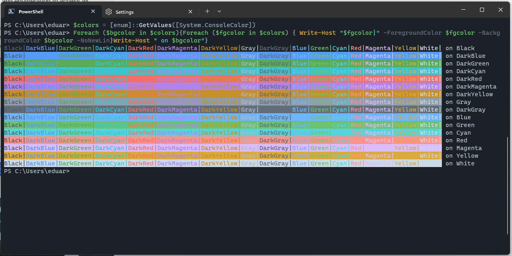
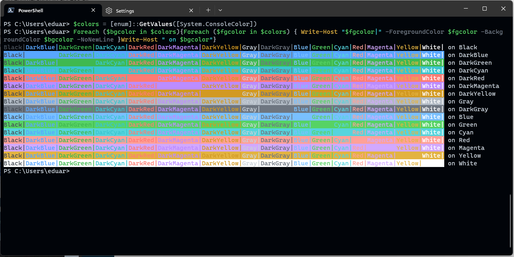
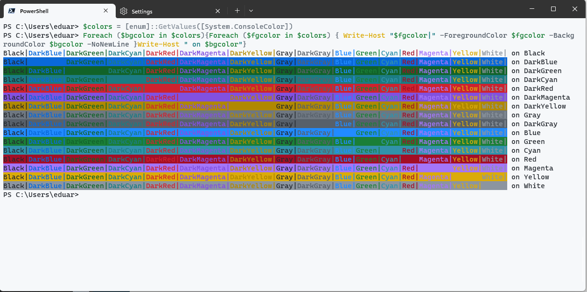

# Windows-Terminal-GitHub-Theme

The VS Code GitHub Theme port for Windows Terminal

## Available Themes

- GitHub Dark Dimmed :star2:
- GitHub Dark Default :star2:
- GitHub Light Default :star2:

## Preview

Here are some previews

### Dark Dimmed

### Dark Default

### Light Default

## How use

Just copy the content in de JSON file to the JSON settings file of Windows Terminal

**Note:
I provide the [json file](./schemes.json) for you can copy and paste see the schemes.json file in the root directory! ;)**

## Work in progress

- GitHub Light High Contrast :hourglass:
- GitHub Light Colorblind :hourglass:
- GitHub Dark High Contrast :hourglass:
- GitHub Dark Colorblind :hourglass:

### Not implemented

- GitHub Light (legacy) :x:
- GitHub Dark (legacy) :x:

## Credits

Visual Studio Code GitHub Theme

[github-vscode-theme](https://github.com/primer/github-vscode-theme)
